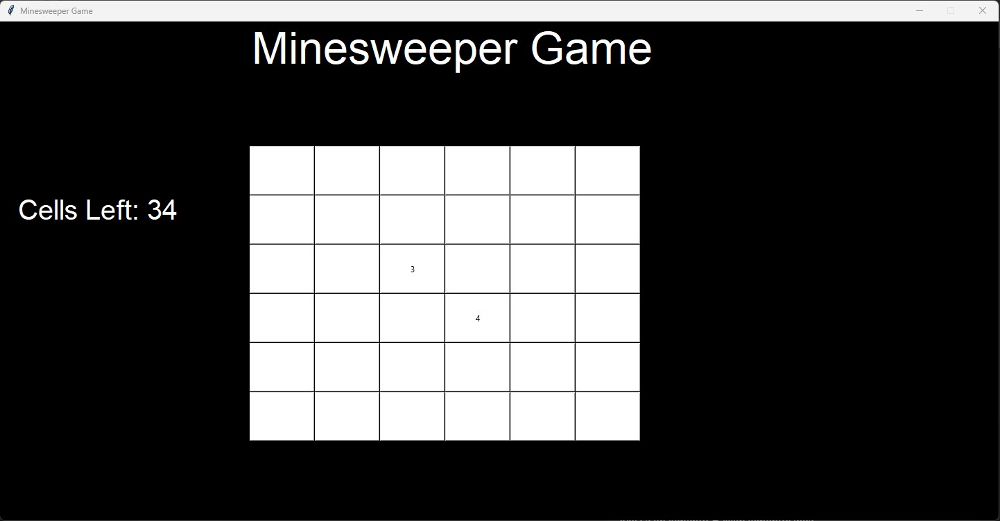

# 🧨 Minesweeper en Python con Tkinter  

Un clon clásico del **Buscaminas (Minesweeper)** desarrollado en **Python** utilizando la librería gráfica **Tkinter**.  
Este proyecto es una implementación simple y entretenida del juego de lógica popularizado por Microsoft Windows.  

---

## 🎮 Capturas de pantalla  

